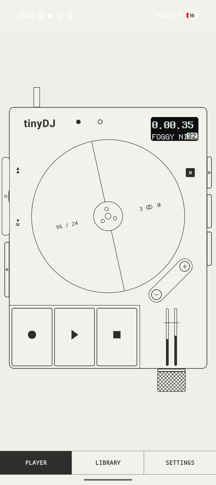
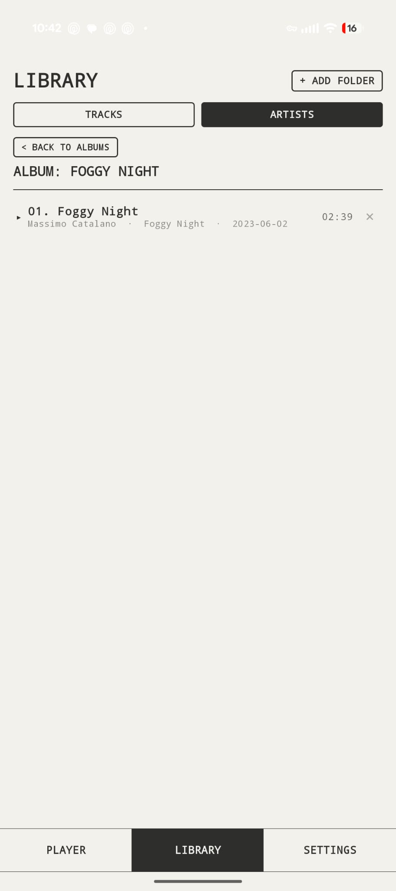
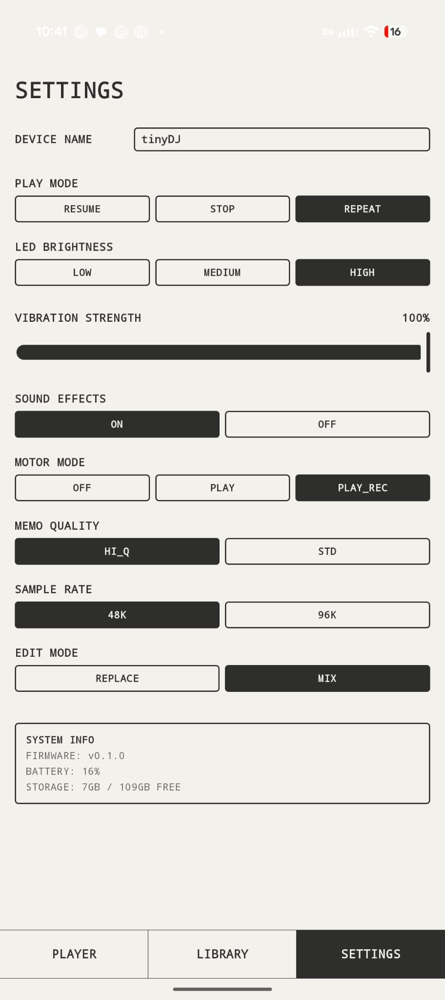

# tinyDJ for Android

A single-deck, motorized-reel audio player for Android. One big spinning disc you
grab with a finger to **scrub, scratch, and varispeed** FLAC and MP3 files, with
rich **haptics** that make the reel detents and buttons feel physical.

<p align="center">
  
  
  
</p>

The audio core is a low-latency **C++/Oboe** engine: the whole file is decoded to
PCM in RAM and read through a fractional pointer, so scrubbing is sample-accurate
and the reel produces real **audible scratch** — forward and backward.

## Build (Docker — the verified path)

The whole toolchain is Dockerized (JDK 21, Android SDK 35, NDK 27, CMake 3.22.1,
Gradle 8.10.2), so you don't need a local SDK. From the repo root:

```sh
./build.sh
```

This fetches the decoder headers, builds the `tinydj-builder` image on first run
(point it at your Android SDK base image with `TINYDJ_BASE=<image> ./build.sh`, or
`docker tag <your-android-image> tinydj-base:latest` first), and produces:

```
app/build/outputs/apk/debug/app-debug.apk
```

The APK contains `libtinydj-audio.so` (the native engine) + `liboboe.so` +
`libc++_shared.so` for `arm64-v8a`, `armeabi-v7a`, and `x86_64`.

Install on a connected phone with `adb install -r app/build/outputs/apk/debug/app-debug.apk`.

## Build (Android Studio — alternative)

1. Fetch the decoders: `./app/src/main/cpp/third_party/download_dr_libs.sh`
2. Open the folder in **Android Studio** (Ladybug+), install **NDK `27.0.12077973`**
   and **CMake** via SDK Manager (change `ndkVersion` in
   [`app/build.gradle.kts`](app/build.gradle.kts) if yours differs), let it sync.
3. Run on your phone, or `./gradlew installDebug`.

> Test on a **physical Android phone** (min Android 12 / API 31). An emulator cannot
> reproduce the haptics or the low-latency audio — the whole point of the app — so
> test on real hardware with a good vibration motor (recent Pixel / flagship Samsung).

## Using it

The interface consists of a 3-tab layout (`PLAYER`, `LIBRARY`, and `SETTINGS`). The player face is a faithful, de-branded clone of the reference hardware, and mirrors its physical layout:

- **Long-press the mode capsule** (left edge, below the rocker) or tap the **LIBRARY** tab to open the file library. **+ ADD** loads FLAC/MP3 files; they are remembered across launches via Storage Access Framework persisted permissions. Tap a track to load it.
- **play** starts playback; tap **play** again to **reverse** the direction (the glyph mirrors on the OLED). **Hold the reel** to pause; release to continue. **stop** pauses where you are, then a second press rewinds to the start.
- **+ / −** skip to the next / previous track.
- Tap **mode**, then **turn the reel** to set varispeed (−99 … +200 %); it detents back to 0 at the center. An animated slider/ruler indicator on the OLED displays the current speed setting relative to the center 0. Tap **mode** again to exit.
- The **left rocker**: press-and-hold the top to fast-forward (`▲▲`), the bottom to rewind (`R▼`) for an audible scan.
- **Grab the reel** and drag to scrub/scratch: slow drags trigger detent haptic ticks, while fast spins produce authentic scratch DSP sounds.
- Roll the **knurled crown** (bottom-right) up/down for volume. Toggle **REPEAT** in the library sheet.
- **Immersive Fullscreen**: The application automatically hides status and navigation bars to provide a clean, distraction-free screen layout.

---

### Player Style Modes (Original vs. Advanced)

Under the **SETTINGS** tab, you can select the player's view configuration:

#### 1. Original Mode
A direct, classic recreation of the physical player hardware with no extraneous controls, running on the stock low-latency audio path.

#### 2. Advanced Mode
Expands the app with modern DJ performance features and visual modifications:
- **Diagonal A/B Loop Buttons**: Situated on the lower-left shoulder of the motorized reel disc. 
  - Tap **A** to set the Loop In point.
  - Tap **B** to set the Loop Out point, which immediately triggers loop playback.
  - Hold **A** to clear the loop points.
  - The OLED screen shows a loop indicator badge (`A` or `A-B`) adjacent to the track number.
- **Slip Mode**: When enabled, scratching, loop playback, or reverse play will not disrupt the timeline's natural progression. A background virtual playhead continues to advance at normal speed. When you release the reel or exit the loop, playback snaps seamlessly to the position of the virtual playhead.
- **Tape Flutter**: Simulates analog tape transport instability by applying Wow (1.2 Hz) and Flutter (8.0 Hz) speed/pitch modulation.
- **Pitch Ramps**: Simulates mechanical platter inertia of a direct-drive motor. Playback ramps up smoothly when starting, and decelerates gradually when pausing or stopping.
- **Theme Options**: Choose between `LIGHT`, `DARK`, and pure black `OLED` visual appearances.
- **Enhanced OLED System Settings**: Customize individual parameters in the LED menu page including LED brightness levels (LOW, MED, HIGH), and quick toggles for Tape Flutter, Pitch Ramps, and Slip Mode.
- **Rolling Digits Timecode**: The OLED playback timecode features smooth vertical digit-rolling animations as the track progresses.

---

### Background Playback & Media Session
The player includes background playback support implemented via an Android Foreground Service (`PlaybackService`).
- When playback is active, the service maintains audio playback even if the application is closed or minimized.
- System-wide **MediaSession** integration publishes active track metadata to the OS.
- A media notification is displayed on the lock screen and notification drawer featuring play/pause controls.

---

## How it fits together

```
ui/deck      DeckScreen, DeckContent (the device face), ReelDisc (the gesture+canvas
             core), TransportKeys / SideRocker / RotaryKnob / DeviceControls (the
             machined controls), MiniLcd / OledScreens (the OLED drawing), LoopButtons,
             SettingsView (advanced controls sheet), DeckViewModel (StateFlow orchestration)
ui/library   LibrarySheet, LibraryView
core/audio   AudioEngine (the seam) · OboeAudioEngine (JNI) · PlaybackService (background play) · FakeAudioEngine
core/haptics HapticEngine · SystemHapticEngine (capability detection + fallback) ·
             HapticThrottler (anti-flooding) · HapticSpec (the effect vocabulary)
data/library LibraryRepository · MetadataExtractor (SAF + MediaMetadataRetriever)
cpp/         native_audio_engine.cpp (Oboe stream + dr_libs decode + scratch, loop, slip, flutter DSP)
```

The UI/ViewModel depend only on the `AudioEngine` / `HapticEngine` interfaces, never on Oboe or JNI types — so the engine can evolve (or be faked for `@Preview`) without touching the UI.

## Tuning knobs

- Reel feel: `SECONDS_PER_REV`, `DETENTS`, `MAX_SPEED`, `SPIN_THRESHOLD` in
  [`ReelDisc.kt`](app/src/main/java/com/tinydj/ui/deck/ReelDisc.kt).
- Haptic intensity + per-effect mapping: [`SystemHapticEngine.kt`](app/src/main/java/com/tinydj/core/haptics/SystemHapticEngine.kt);
  detent rate-limit in [`HapticThrottler.kt`](app/src/main/java/com/tinydj/core/haptics/HapticThrottler.kt).
- Scratch interpolation / buffering / slip & flutter parameters: `native_audio_engine.cpp`.

## Status

**Builds cleanly** (verified via Docker): debug APK with the native engine compiled for all three ABIs.

Implemented end to end: Oboe scratch engine (FLAC+MP3 decode, reverse, sample-accurate, looping, slip mode, tape wow/flutter, pitch ramping), the reel gesture→scratch→detent loop, haptics with capability detection + fallback + throttling, SAF library with persisted picks and metadata, background playback service and media notification, immersive fullscreen mode.

Not yet wired (intentional next steps):

- **Audio focus / "becoming noisy"** (pause on call / unplug).
- **Windowed PCM buffer** for very long or 96 kHz files (today the whole track is
  decoded to RAM — fine for typical 3–6 min tracks).
- MediaStore "browse my music" mode (SAF picking is the current path).

